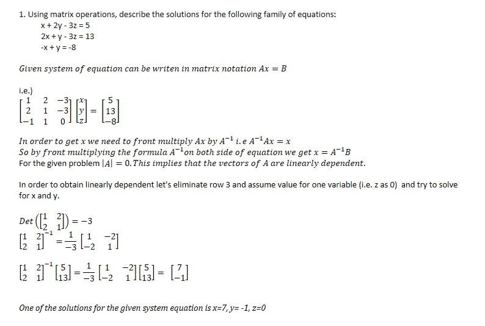
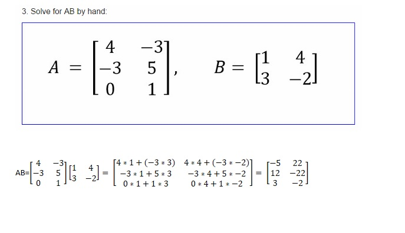

## Week 4 MSDA Math Bridge Assignment ##
###Question 1 - Solve By Hand###

  
###Question 2 - Solve using R###
####Solution using matrix multiplication####
Let's represent given system of equation as matrix
```{r}
A<-matrix(c(1,2,-1,2,1,1,-3,-3,0),3)
B<-matrix(c(5,13,-8),3)
A
B
```
Let's check determinant of A
```{r}
det(A)
```
Determinant of A is zero. So, the vectors of matrix are linearly dependent. Let's drop a vector and assume value of varaiable (i.e z = 0) and check again
```{r}
A1<-A[1:2,1:2]
B1<-B[1:2]
det(A1)
```
Now, the determinant is non zero. Let's solve the equation
```{r}
solve(A1)%*%B1
```
So, One of the solutions for the given system equation is x=7, y= -1, z=0

####Easy solution using lm() function####
Let's solve the equation using lm() function.
Construct a dataframe with variables and result
```{r}
df1<-as.data.frame(cbind(A,B))
df1
lm(V4~.,data=df1)
```
From coefficients of the lm() function x=7, y=-1 and z=0

###Question 3 - Solve By Hand###

  
###Question 4 - Solve using R###
```{r}
A=matrix(c(4,-3,0,-3,5,1),3)
B=matrix(c(1,3,4,-2),2)
A
B
```
Matrix Multiplication
```{r}
A%*%B
```